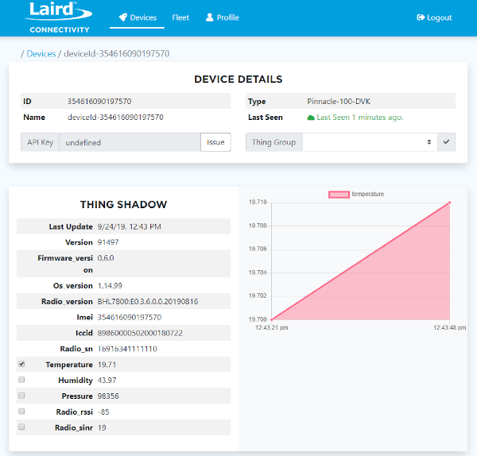

# Pinnacle 100 Out of Box Demo

## Introduction
The Pinnacle 100 out of box demo demonstrates gathering sensor data over BLE and sending the data to the cloud (AWS) via LTE Cat-M1.
The BLE sensor that is required for the demo is the BL654 BME280 sensor.  The sensor measures temperature, humidity and pressure.
The Pinnacle 100 will scan for BLE sensors and connect to the first sensor it finds.
Using the Laird Pinnacle Connect mobile app, the user can provision the Pinnacle 100 to connect to AWS.  Once connected to AWS, the Pinnacle will send sensor data to the cloud every 30 seconds.

```
                XXXXX
              XXX   XXX
    XXXXX   XX        XX
 XXX    XX XX          X XXXXXXX
 X        XX            X       XX
X                                X
 X         AWS Cloud              X
 XX                              X
  XXXXXXX                       XX
        XX          XXXX    XXXX
         XXX      XXX   XXXX
           XXXXXXX
               ^
               |
              LTE
               |
               |
     +---------+----------+
     |                    |
     |  Pinnacle 100 DVK  |
     |                    |
     +---------+----------+
               ^
               |
              BLE
               |
    +----------+------------+
    |                       |
    |  BL654 BME280 Sensor  |
    |                       |
    +-----------------------+

```

## Resources
* [Pinnacle 100 product page](https://www.lairdconnect.com/wireless-modules/cellular-solutions/pinnacle-100-modem)

## Prerequisites
The following are required to use the Pinnacle 100 out of box demo:
* An activated SIM card
* Pinnacle 100 DVK programmed with out of box demo firmware. Releases available [here!](https://github.com/LairdCP/Pinnacle_100_oob_demo/releases)
* Laird Pinnacle Connect app installed on a mobile device
  * [Android app](http://play.google.com/store/apps/details?id=com.lairdconnect.pinnacle.connect)
  * [iOS app](AppStore.com/LairdPinnacleConnect)

## Setup

To set up the demo, follow these steps:
1.	Install the activated SIM card into the Pinnacle 100 modem SIM slot.
2.	Plug the modem into the dev board.
3.	Program the Pinnacle 100 Out of Box demo firmware.
4.	Launch the mobile app.

## Using the Demo
### Signup and Login
If you do not already have an account, you must create one.  An email address shall be used for the username.

  <br>
*Sign-up and Login screens*

### Scan for Devices
Once logged in, the scan screen displays.

<br>
*Scan screen*

To scan for devices, follow these steps:
1. Click **Find Pinnacle Devices**. Discovered devices will be displayed.
>**Note:** The device name contains the last seven digits of the IMEI of the device so that you can easily identify the device to which you wish to connect. The IMEI is printed on the Pinnacle 100 Modem label.

<br>
*Scan screen - devices found*

2. Click on the desired device to connect to it.

### Device Information Page
The Device Information page acts as a home page for the device. It displays all relevant device status information. The only available actions are the ability to provision or decommission the device.
>**Note:** Provisioning is only allowed if the device is in an un-provisioned state.

<br>
*Device Information screen*

### Provision
To provision the device click **Provision**.
During provisioning, certificates are generated for the device and then programmed into the device over BLE.

<br>
*Provision in process*

Once sending provisioning data is complete, a prompt displays and you are directed back to the information page.

<br>
*Provisioning is complete*

Once the device is successfully connected to Amazon Web Services (AWS), the provisioning data is committed to non-volatile memory in the Pinnacle 100 modem. If the pinnacle 100 is then reset or power-cycled, it automatically re-connects to AWS. If the Pinnacle 100 is reset or power cycled before a successful AWS connection, you must re-provision the device.

<br>
*Device commissioned and connected to AWS*

>**Note:** You can decommission a device if you no longer want it to connect to AWS. Just click **Decommission**

<br>
*Device decommissioned*

## Cloud Data
Once the Pinnacle 100 has been commissioned with the mobile app and it is connected to AWS, the user can log into the web portal to view sensor data.

The web portal is located at: <https://demo.lairdconnect.com>

Log in with the same credentials used to login to the mobile app.

Once logged in go to the devices page to see devices that have been added to the user account.

<br>
*Web portal devices page*

Each pinnacle 100 that is added is identified by its IMEI.

Click on the device ID to display its data.

<br>
*Device data*

The Pinnacle 100 will report sensor data every 30 seconds.  The user can select the check box next to any numeric value to see the value in the graph.  The graph only displays live data that is logged while viewing the webpage.  If the user leaves the web page and returns, the graph will start over with the most recent data that was received when returning to the page.

## Cloning
This is a Zephyr based repository.  To clone this repository properly use the `west` tool. To install west you will first need Python3.

Install `west` using `pip3`:
```
# Linux
pip3 install --user -U west

# macOS (Terminal) and Windows (cmd.exe)
pip3 install -U west
```

Once `west` is installed, clone this repository by:
```
west init -m https://github.com/LairdCP/Pinnacle_100_oob_demo.git
west update
```

## Preparing to Build
If this is your first time working with a Zephyr project on your PC you should follow the [Zephyr getting started guide](https://docs.zephyrproject.org/latest/getting_started/index.html#) to install all the tools.

It is recommended to build this firmware with the [GNU Arm Embedded Toolchain: 8-2019-q3-update](https://developer.arm.com/tools-and-software/open-source-software/developer-tools/gnu-toolchain/gnu-rm/downloads).

## Building the Firmware
From the directory where you issued the `west init` and `west update` commands you can use the following command to build the firmware:
```
# Windows
west build -b pinnacle_100_dvk -d pinnacle100\build pinnacle100\oob_demo -- -D BOARD_ROOT=%cd%\pinnacle100

# Linux and macOS
west build -b pinnacle_100_dvk -d pinnacle100/build pinnacle100/oob_demo -- -D BOARD_ROOT=$PWD/pinnacle100
```
## LED behavior
LED1 - LED4 are all on when the modem is booting.

The Blue LED (LED1) will blink once a second when the Pinnacle is searching for a Bluetooth sensor.  When it finds a sensor and successfully connects to it, the LED will stay on.

The Green LED (LED2) will turn on when connected to AWS.  When data is sent to AWS the LED will turn off for 1 second and then turn back on.  When disconnected from AWS the led will remain off.

The Red LED (LED3) will blink when the Pinnacle is searching for a cellular network.  It will remain on and not blink when connected to a network.  If there is an error with the SIM card or network registration, then the led will remain off.


## BLE Profiles
Details on the BLE profiles used to interface with the mobile app can be found [here](docs/ble.md)

## Development and Debug
See [here](docs/development.md) for details on developing and debugging this app. 