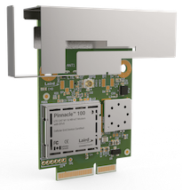
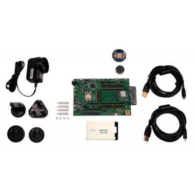
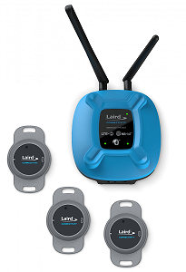

> **WARNING:** This is a Zephyr-based repository, **DO NOT** `git clone` this repo. To clone and build the project properly, please see the instructions in the [Pinnacle 100 Firmware Manifest](https://github.com/LairdCP/Pinnacle-100-Firmware-Manifest) repository.

### To evaluate the OOB demo, download pre-built firmware images [here!](https://github.com/LairdCP/Pinnacle-100-Firmware/releases) You do not need to build the application if no customizations are necessary.

# BLE Gateway Out-of-Box (OOB) Demo Firmware

  

This repository contains firmware that can run on the Pinnacle 100 Modem development kit (DVK), Sentrius MG100 gateway, or the BL5340 DVK. This firmware is designed to showcase gathering sensor data over BLE and transferring it to the cloud. The OOB Demo firmware connects to the Laird Connectivity Bluegrass Cloud portal by default. However it can be reconfigured over the UART with mcumgr to provision the device to connect to any AWS server.

The Pinnacle 100 modem can be purchased separately as a device that OEMs embed into their end product. The same Pinnacle modem is pre-integrated by Laird Connectivity into the Sentrius MG100 Gateway. The MG100 is an out-of-the-box product allowing the end user to develop a fully featured IoT solution with minimum effort. With the addition of the optional battery backup, it provides uninterrupted reporting of sensor data. Additionally the sensor data is logged locally on an SD card to ensure data is captured even if the LTE connection is interrupted. Based on Laird Connectivity's Pinnacle 100 modem, the Sentrius MG100 Gateway captures data from Bluetooth 5 sensors and sends it to the cloud via a global low power cellular (LTE-M/NB-IoT) connection. It is based on the innovative integration of Nordic Semiconductor nRF52840 and the Sierra Wireless HL7800 module. This enables the MG100 hardware to support LTE-M/NB-IoT (supports LTE bands 1, 2, 3, 4, 5, 12, 13, 20, and 28) as well as Bluetooth 5 features like CODED PHY, 2M PHY, and LE Advertising Extensions.

A version of the MG100 firmware can be built to support contact tracing applications with the appropriate Laird Connectivity Contact Tracing BLE product (Sentrius BT510-CT and Sentrius BT710). Please contact your local Sales representative to find out further details on these sensors - sales@lairdconnect.com

> **Note:** This readme file and associated documentation should be viewed on GitHub selecting the desired branch. The main branch will always be up to date with the latest features. Viewing documentation from a release GA branch is recommended to get documentation for the specific feature set of that release.

The firmware can operate in three modes:

- [Out-of-Box AWS Demo](#out-of-box-oob-aws-demo)
- [LwM2M Demo](#lwm2m-demo)
- [Contact Tracing](#contact-tracing-firmware)

These modes are selected at compile time. See the following sections for documentation on the firmware and how it operates.

## Out-of-Box (OOB) AWS Demo

[**Getting started guide here!**](docs/readme_ltem_aws.md)

## LwM2M Demo

[**LwM2M Demo guide here!**](docs/readme_nbiot_lwm2m.md).

## Contact Tracing Firmware

[**Contact Tracing guide here!**](docs/contact_tracing.md)

## Firmware Updates

If the Pinnacle 100 device is running v2.0.0 firmware or earlier, firmware updates must be programmed via SWD(Serial Wire Debug). There is no FOTA capability in the 2.x releases. To perform the update this way, please consult:

- MG100: the MG100 Hardware Guide section 5.4.4 to learn how to connect a J-Link debugger to the board.
- Pinnacle 100 DVK: The DVK has a built in debugger to easily program firmware.

Pinnacle 100 devices with firmware version 3.x or greater support firmware updates via UART, BLE or LTE. Updates via LTE on 3.x firmware must be initiated from the Laird Connectivity Bluegrass cloud portal. Only images hosted by Laird Connectivity are supported on the 3.x release. On 4.x releases, updates over HTTPS can be initiated for images hosted on any AWS server.

To update firmware with the Pinnacle Connect mobile app or via the Bluegrass cloud portal [see here.](docs/readme_ltem_aws.md#firmware-updates)

To update firmware over UART using the mcumgr CLI. This allows the user to update the device without any wireless connectivity. [see here.](docs/firmware_update.md)

To update firmware over HTTPS. Updates over HTTPS have been decoupled from Laird Connectivity's Bluegrass cloud portal. Images hosted on any AWS server can be downloaded. The details on how to trigger the update via the device shadow are available [here.](docs/cloud_fota.md)

## Development

### BLE Profiles

Details on the BLE profiles used to interface with the mobile app can be found [here](docs/ble.md)

### Development and Debug

See [here](docs/development.md) for details on developing and debugging this app.
