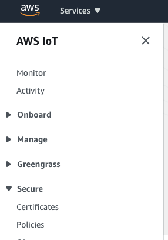
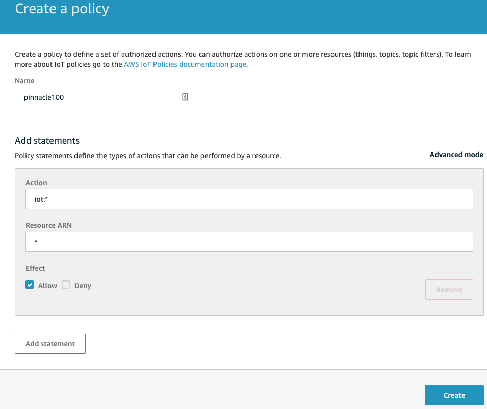
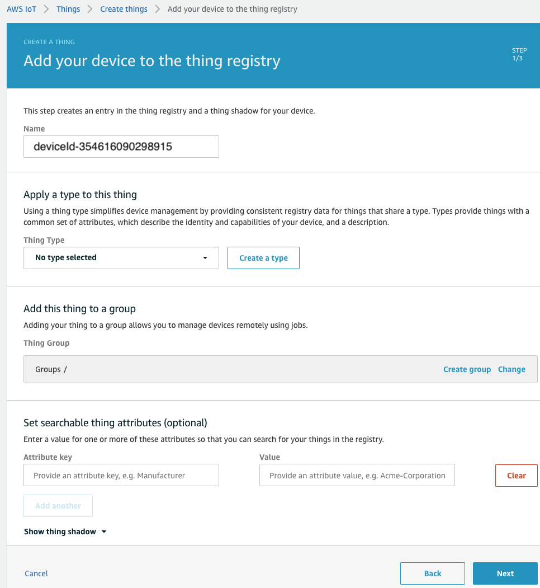
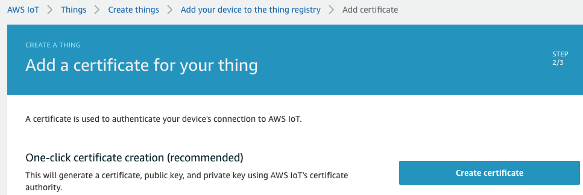
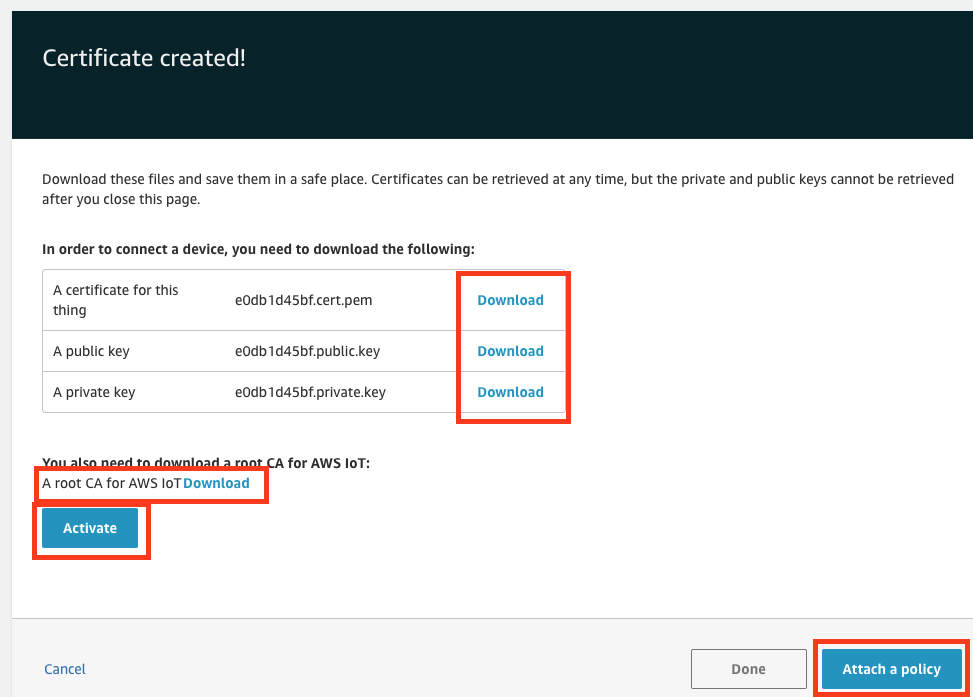
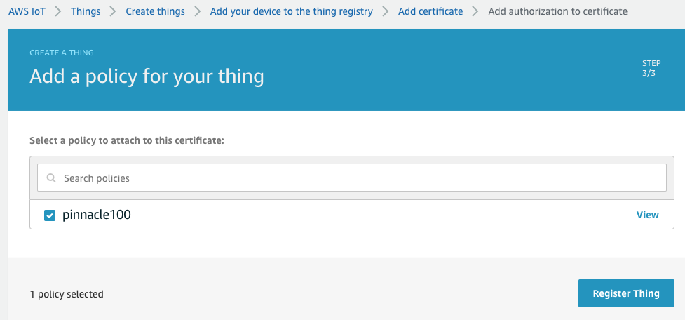
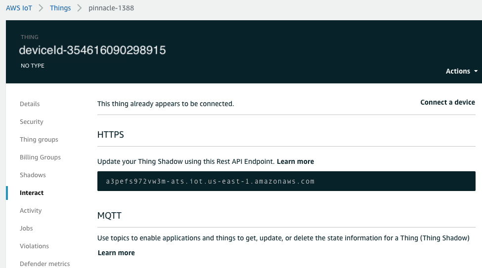
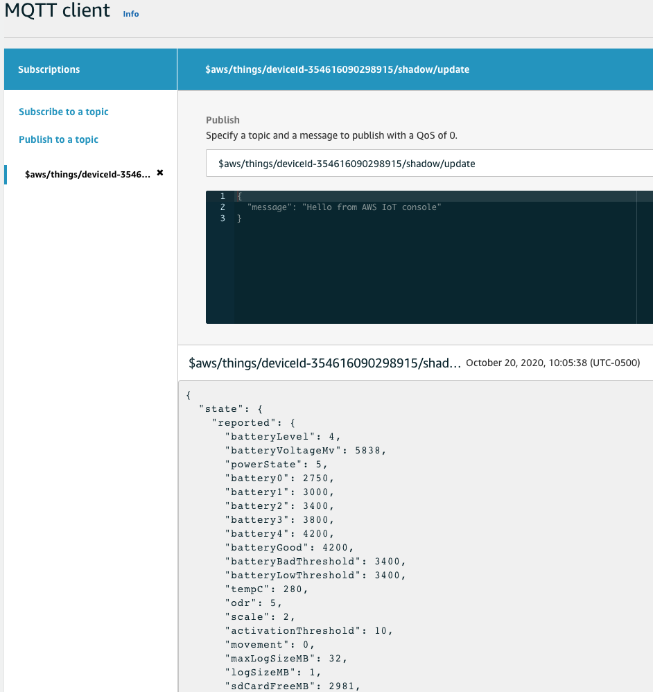

# Connecting to Amazon AWS IoT

## Table of Contents

1. **[Introduction](#introduction)**
2. **[Prerequisites](#prerequisites)**
3. **[AWS IoT Core Setup](#aws-iot-core-setup)**  
   [Account Setup](#account-setup)  
   [Setup a Policy](#setup-a-policy)  
   [Create a Thing](#create-a-thing)
4. **[Configure Device for AWS Connection](#configure-device-for-aws-connection)**  
   [Prerequisites](#prerequisites)  
   [Provisioning the Device Via UART](#provisioning-the-device-via-uart)  
   [Monitor AWS Messages](#monitor-aws-messages)
5. **[AWS Topics](aws_topics.md)**

## Introduction

The AWS Out-of-Box (OOB) Demo firmware connects to the Laird Connectivity Bluegrass cloud by default. This document will describe how to setup a new AWS IoT core account and reconfigure the firmware to connect to it.

## Prerequisites

- AWS OOB demo firmware 3.x or later

## AWS IoT Core Setup

### Account Setup

Before starting, an AWS account is required. Amazon offers a [free account](https://aws.amazon.com/free) that can be used for evaluation purposes.

### Setup a Policy

In order for the IoT device to connect, a policy needs to be created to assign permissions to the device.

Login to the [AWS IoT console](https://console.aws.amazon.com/iot/)

In the left-hand menu, navigate to Secure -> Policies.

  
_Policies_

Click Create a policy.

- Give the policy a name.
- Enter `iot:*` for the Action.
- Enter `*` for the Resource ARN.
- Check the Allow box.

Finally click Create.

> **Note:** This policy is extremely permissive. It is recommend to setup policies only be as permissive as necessary. See [here](https://docs.aws.amazon.com/iot/latest/developerguide/device-shadow-mqtt.html?icmpid=docs_iot_console)

  
_Create Policy_

### Create a Thing

In the left-hand menu, navigate to Manage -> Things and click Create on the far right.

Click Create a single thing.

Enter a name and click Next.

> **Note:** The OOB demo firmware expects the thing name to be in this format `deviceId-<IMEI>` where `<IMEI>` should be replaced by the IMEI of your device.

  
_Thing Name_

Create a certificate using the One-click certificate creation by clicking Create certificate.

  
_Create Cert_

Download the device certificate, keys, and Amazon Root CA.

Activate the certificate and then click attach policy.

  
_Download Cert_

Select the policy that was created previously and click Register Thing.

  
_Attach Policy_

## Configure Device for AWS Connection

The Pinnacle 100 device can be provisioned to communicate with the Bluegrass AWS demo site via the mobile app. In order to connect to an alternate AWS IoT Core instance, the device can be provisioned via UART.

### Prerequisites

1. [mcumgr CLI](https://github.com/apache/mynewt-mcumgr#command-line-tool) (cross platform)
2. Pinnacle 100 device running AWS OOB demo firmware v3.x or greater
3. Terminal program: Putty (Windows,Linux,macOS), Teraterm (Windows), Serial (macOS)

### Provisioning the Device Via UART

1. Connect a terminal program to the console UART and turn off log messages. Log messages output by the firmware can interfere with the file transfer process.

   Issue command:

   ```
   log halt
   ```

2. Disconnect the terminal program from the console UART and transfer the credentials to the device using the mcumgr CLI via the console UART. Three files need to be transferred to the device, the root CA, client certificate, and client key.

   ```
   # Linux/macOS

   mcumgr -t 5 -r 2 --conntype serial --connstring dev=/dev/tty.usbserial-A908JLEI,mtu=2048 fs upload /Users/ryan/Desktop/test_aws/AmazonRootCA1.pem /lfs/root_ca.pem
   mcumgr -t 5 -r 2 --conntype serial --connstring dev=/dev/tty.usbserial-A908JLEI,mtu=2048 fs upload /Users/ryan/Desktop/test_aws/5d9f1885c1-certificate.pem.crt /lfs/client_cert.pem
   mcumgr -t 5 -r 2 --conntype serial --connstring dev=/dev/tty.usbserial-A908JLEI,mtu=2048 fs upload /Users/ryan/Desktop/test_aws/5d9f1885c1-private.pem.key /lfs/client_key.pem

   # Windows

   mcumgr -t 5 -r 2 --conntype serial --connstring dev=COM4,mtu=2048 fs upload C:\test_aws\AmazonRootCA1.pem /lfs/root_ca.pem
   mcumgr -t 5 -r 2 --conntype serial --connstring dev=COM4,mtu=2048 fs upload C:\test_aws\5d9f1885c1-certificate.pem.crt /lfs/client_cert.pem
   mcumgr -t 5 -r 2 --conntype serial --connstring dev=COM4,mtu=2048 fs upload C:\test_aws\5d9f1885c1-private.pem.key /lfs/client_key.pem

   ```

3. Re-connect the terminal to the console UART and restart logging.

   ```
   log go
   ```

4. Set AWS endpoint

   To direct the Pinnacle 100 device which AWS instance to connect to, the endpoint must be set. To determine the correct endpoint login to the [AWS IoT console](https://console.aws.amazon.com/iot/) and click on the thing that was just registered. Go to the section labeled Interact and copy the endpoint listed under the HTTPS section.

     
   _AWS Endpoint_

   Connect the terminal program to the console UART and set the endpoint.

   ```
   aws endpoint a3pefs972vw3m-ats.iot.us-east-1.amazonaws.com
   ```

5. Enable AWS connection and reboot

   ```
   aws enable 1

   kernel reboot cold
   ```

   After a reboot, the device will connect to the AWS instance after an LTE signal is acquired.

### Monitor AWS Messages

With the AWS IoT console, you can watch for MQTT data sent by the device. Got to the left-hand menu in the console and click on test.

In Subscription topic, enter `$aws/things/deviceId-<my_imei>/shadow/update` where `<my_imei>` is replaced by the imei of your device. Then click Subscribe to topic. JSON data will be displayed once the MG100 sends data.

  
_MQTT Data_
