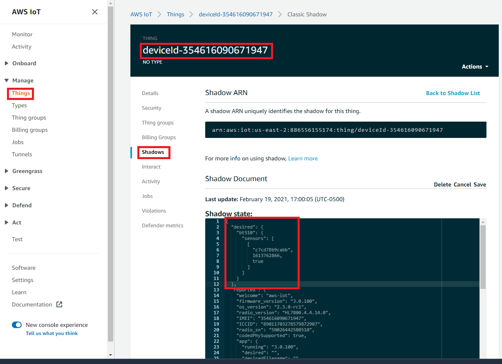

# AWS Topics

## Introduction

Communication between the gateway and AWS uses 4 topics.

## Gateway Topics

The gateway uses the following topics. The IMEI of the device is used to differentiate gateways. For example, "\$aws/things/deviceId-354616090287629/shadow/get/accepted".

1. "\$aws/things/deviceId-<imei>/shadow/update" (publish)
2. "\$aws/things/deviceId-<imei>/shadow/update/delta" (subscribe)
3. "\$aws/things/deviceId-<imei>/shadow/get" (publish)
4. "\$aws/things/deviceId-<imei>/shadow/get/accepted" (subscribe)

After reset the gateway subscribes to the "get/accepted" topic and then publishes a message to "get". The publish to "get" causes the shadow to be received on the "get/accepted" topic. The gateway then processes the received shadow to restore its state. Once "get/accepted" has been processed the gateway unsubscribes from "get/accepted" and starts publishing to "shadow/update". Unsubscribing from "get/accepted" isn't required. However, it is used as trigger in the system to allow different sources to publish to the shadow. The gateway subscribes to the "update/delta" topic to receive state changes from AWS.

## Sensor Topics

Sensors such as the BT510 are enabled in the gateway shadow. However, the data for each sensor is published to its own topic based on its Bluetooth address. For example,
"\$aws/things/de901d27b28d/shadow/update".

1. "\$aws/things/\<BluetoothAddress>/shadow/update" (publish)
2. "\$aws/things/\<BluetoothAddress>/shadow/update/delta" (subscribe)
3. "\$aws/things/\<BluetoothAddress>/shadow/get" (publish)
4. "\$aws/things/\<BluetoothAddress>/shadow/get/accepted" (subscribe)

The sensor table module controls what data is sent to the cloud.

When a sensor is enabled it will subscribe to "get/accepted" and then process the response shadow that occurs after publishing to the "get" topic. Sensors do not unsubscribe from the "get/accepted" topic because they only receive information on "get/accepted" when they publish to the "get" topic.

Similar to the gateway, the sensor publishes its shadow to "update" and receives desired changes on the "update/delta" topic.

Changes received from AWS on the "update/delta" topic are converted to JSON-RPC commands and sent to the sensor using Bluetooth. Depending on the advertising rate of the sensor, it may take some time for the command to be processed. Once a command has be accepted by the sensor, the gateway will read the configuration of the sensor and publish it to the sensor's shadow.

## Configuring Gateway to Accept Data from a Sensor

A table of sensors is created by the gateway and published to the gateway's shadow. A sensor must be enabled in this table before the gateway will publish its data. Enabling sensors is done by the Bluegrass interface but can also be done using AWS IoT.

### Navigate to Gateway Shadow in AWS IoT

Go to Manage -> Gateway Thing (for example, deviceId-3546090671947) -> Shadows -> Classic Shadow and then click edit.



A list of sensors that have been seen will be part of the shadow. Each entry contains the Bluetooth Address, the epoch (time) that the sensor was last seen, and whether on not it is allowed to publish.

The Bluetooth address can be found on the BT510 and is labeled BLE ID.

```
{
	"bt510": {
		"sensors": [
			[
				"Bluetooth Address",
				Last Seen Epoch,
				Publish
			],
			[
				"DE901D27B28D",
				1614731727,
				true
			],
			[
				"C630157769EE",
				1614731684,
				false
			],
			[
				"DFB086DF3F7D",
				1614731727,
				false
			],
			[
				"C7CD78B9CABB",
				1613762866,
				false
			]
		]
	}
}
```

### Enable Sensor

Change true to false for any sensor that should have its data published.

For example,

```
"desired": {
    "bt510": {
        "sensors": [
            [
                "C7CD78B9CABB",
                1613762866,
                true
            ]
        ]
    }
}
```
