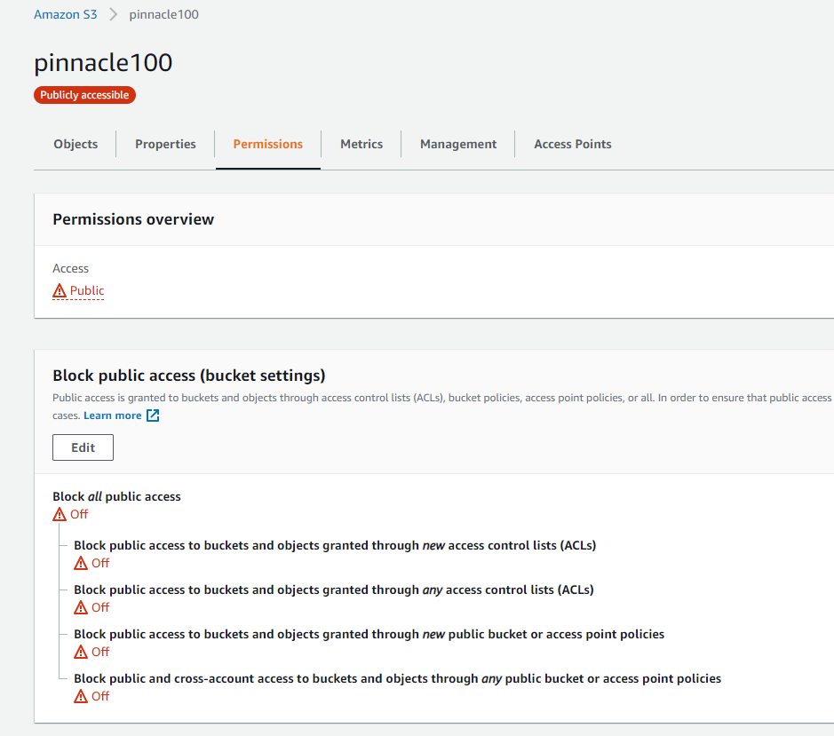

# Cloud FOTA Updates

## Table of Contents

1. **[Introduction](#introduction)**
2. **[Prerequisites](#prerequisites)**
3. **[Upgrade from AWS S3 Bucket](#upgrade-from-aws-s3-bucket)**  
   [Setup S3 Bucket](#setup-s3-bucket)  
   [Get S3 HTTPS Endpoint](#get-s3-https-endpoint)
4. **[Upgrade from AWS EC2 using NGINX](#upgrade-from-aws-ec2-using-nginx)**  
   [Setup EC2 Instance](#setup-ec2-instance)  
   [Install and Prepare NGINX](#install-and-prepare-nginx)
5. **[Trigger Cloud FOTA Upgrade](#trigger-cloud-fota-upgrade)**  
   [Pinnacle 100 and MG100 App Only](#pinnacle-100-and-mg100-app-only)  
   [HL7800 Cellular Modem Only](#hl7800-cellular-modem-only)

## Introduction

Cloud FOTA updates to the Pinnacle 100 and MG100 require, at a minimum, a webserver that can serve up a static webpage containing the \*.bin upgrade file (NOTE: The Pinnacle 100 and MG100 request this file using partial content HTTPS requests to the static webpage). The relevant code to include this functionality in your own project is located in the _<project_folder>/pinnacle_100_firmware/app/http_fota_ folder when you clone the [Pinnacle 100 Firmware Manifest](https://github.com/LairdCP/Pinnacle-100-Firmware-Manifest).

The following discusses how to perform the upgrade two ways, using an Amazon Web Services (AWS) S3 Bucket and using an NGINX webserver running on an AWS EC2 instance.

**NOTE: If you are currently running the OOB Demo Firmware and connected to Laird Connectivity's Bluegrass Demo site, and the desire is to upgrade the OOB Demo Firmware to a newer version, use the instructions [here](https://github.com/LairdCP/Pinnacle-100-Firmware/blob/main/docs/readme_ltem_aws.md#fota-updates-via-the-cloud)**

**WARNING: The Nordic Download Client used to facilitate the HTTPS FOTA Upgrade limits the size of the Download Host DNS and Download File names, the default sizes are as follows:**

```
DOWNLOAD_CLIENT_MAX_FILENAME_SIZE(=192) "Maximum filename length (stack)"
DOWNLOAD_CLIENT_MAX_HOSTNAME_SIZE(=64) "Maximum hostname length (stack)"
```

## Prerequisites

1. Pinnacle 100 or MG100 that supports Cloud HTTP FOTA upgrades, this would include any unit running the OOB Demo v4.0 or above and any custom firmware implementation that includes the Cloud HTTP FOTA functionality
2. \*.bin file for the Firmware you want to load, desired revision must be different than current revision on Pinnacle 100 or MG100
   - Official releases available [here!](https://github.com/LairdCP/Pinnacle_100_firmware/releases)
     - 480-00052 for Pinnacle 100 Modem
     - 480-00070 MG100 Gateway
   - Custom FW builds use **_app_update.bin_** which is located in the build directory `<project_folder>/pinnacle_100_firmware/build/<project>/zephyr/app_update.bin`
3. HTTP or HTTPS endpoint serving a static webpage containing the \*.bin upgrade file, e.g. `http://pinnacle100.com/<bin_filename>.bin`  
   **WARNING:** To use HTTPS, the file must be served from an AWS S3 bucket. There is no support for using a custom HTTPS server at this time.
4. Ability to publish an MQTT message to the Pinnacle 100 or MG100, this could be:
   - Pinnacle 100 or MG100 running the OOB Demo and connected as a Thing through IoT Core in AWS, See [here](aws_iot.md) for instructions
   - Pinnacle 100 or MG100 running custom firmware that includes the Cloud HTTP FOTA and MQTT functionality, used with an MQTT broker like Mosquitto

## Upgrade from AWS S3 Bucket

### Setup S3 Bucket

1. In your AWS account, make a new S3 bucket and give it the following permissions:

```
{
    "Version": "2012-10-17",
    "Id": "Policy1619206380275",
    "Statement": [
        {
            "Sid": "Stmt1619206371073",
            "Effect": "Allow",
            "Principal": "*",
            "Action": "s3:GetObject",
            "Resource": "arn:aws:s3:::pinnacle100/*"
        }
    ]
}
```

2. Make sure that the bucket is publicly available by turning **OFF** _Block Public Access_:

  
_Turning off Public Access_

3. Select **Upload** and drag-and-drop or select **Add Files** to add your \*.bin file to your S# bucket

### Get S3 HTTPS Endpoint

1. Navigate to the location of the \*.bin file in the S3 Bucket
2. Select the \*.bin file by clicking the file or checking the box next to the filename
3. Select **_Copy URL_**  
   **NOTE:** The URL should look similar to this: `https://pinnacle100.s3-us-west-2.amazonaws.com/<finename>.bin`
4. Save this address to be used in the [Trigger Cloud FOTA Upgrade](#trigger-cloud-fota-upgrade) section

**_SKIP TO [Trigger Cloud FOTA Upgrade](#trigger-cloud-fota-upgrade) SECTION_**

## Upgrade from AWS EC2 using NGINX

### Setup EC2 Instance

1. Launch a new EC2 Instance

   - _Choose AMI_: Ubuntu 20.04 was used for this testing
   - _Choose Instance Type_: t2.micro instance is sufficient
   - Keep defaults for _Configure Instance_, _Add Storage_, and _Add Tags_
   - _Configure Security Group_: Select **Add Rule** and select HTTPS and optionally HTTP
   - Select **Review and Launch**

2. Select to use an existing Key Pair, if you have one and have access to it, or generate a new one (**NOTE:** Be sure to save this in a folder that isn't publicly accessible and is Read-Only)
3. Wait for the EC2 Instance to enter the _Running_ state and note its Public IPv4 DNS
4. Follow instructions [here](https://docs.aws.amazon.com/quickstarts/latest/vmlaunch/step-2-connect-to-instance.html) to connect to your EC2 Instance
5. Run the following commands to update your EC2 Instance
   - `sudo apt update`
   - `sudo apt upgrade`

### Install and Prepare NGINX

1. Install NGINX on your EC2 Instance using the following command:
   `sudo apt install nginx`
2. Navigate to the _/var/www/_ directory and modify the permissions for the _/html_ folder by issuing the following:

```
~$ cd ..
/home$ cd ..
/$ cd var/www
/var/www$ sudo chmod 777 ./html
```

3. Use Secure Copy (scp or pscp) to copy the \*.bin file into the _/var/www/html/_ directory

## Trigger Cloud FOTA Upgrade

To start a firmware update, publish an MQTT message to the device update topic for the Pinnacle 100 or MG100 (e.g. `$aws/things/deviceId-<Pinnacle_MG100_deviceId>/shadow/update`). Do not attempt to do both modem and app firmware at the same time.

### Pinnacle 100 and MG100 App Only

Replace the values under "app" with those that correspond to your update. If you use a folder structure in your S3 Bucket or NGINX Server, be sure to note that in the `downloadFile` entry (e.g. fw/480-00052-R4.0.0.1614788169_LTE-M_FOTA.bin).

**NOTE 1:** If using an S3 Bucket as the host, only copy in the piece up to and including the _'.com'_ to `downloadHost` , the remaining bit (file location) gets copied into `downloadFile` (excluding the leading _'/'_)

**NOTE 2:** The Pinnacle 100/MG100 will request the download using a Partial Content Header and defaults to 2KB chunks with each request. To change the size of these chunks see information [here](https://developer.nordicsemi.com/nRF_Connect_SDK/doc/1.5.1/nrf/include/net/download_client.html#download-client-https)

```
{
    "state": {
        "desired": {
            "app": {
                "desired": "4.0.0",
                "downloadHost": "https://<S3_Bucket_HTTPS_or_Public_IPv4_DNS_for_EC2>.com",
                "downloadFile": "480-00052-R4.0.0.1614788169_LTE-M_FOTA.bin",
                "start": 1611172151,
                "switchover": 1611172151
            }
        }
    }
}
```

The `desired` firmware version must be different from the running firmware version to kick off the update.
`start` is the time used to schedule when to download the update. If time is in the past, it will begin immediately.
`switchover` is the time used to schedule when to install the update. If time is in the past, it will begin immediately.

### HL7800 Cellular Modem Only

IMPORTANT NOTE: Contact Laird Connectivity technical support to obtain an official modem update. Flashing in an
unsupported version may cause your device to malfunction.

To update the hl7800, replace the values under "hl7800" with those that correspond to your update.

```
{
    "state": {
        "desired": {
            "hl7800": {
                "desired": "4.4.14.99",
                "downloadHost": "https://<Laird_Connectivity_Server_Address>.com",
                "downloadFile": "Sentrius-MG100/hl7800/4.4.14.99/4.4.14.0_4.4.14.99.bin",
                "downloadedFilename": "4.4.14.0_4.4.14.99.bin",
                "hash": "8752ce900ced895d548f8dafc0740270dc6a9bc4ee512cbd46f08aeefae04944",
                "start": 0,
                "switchover": 0
            }
        }
    }
}
```

The `hash` value is only used to validate the integrity of the downloaded modem images. The hash value is a sha256 hash.
