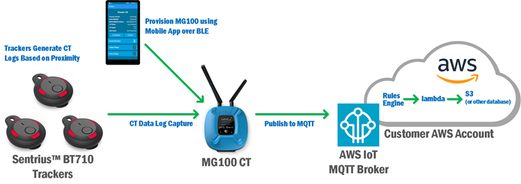

# Contact Tracing

Contact Tracing (CT) is a version of gateway firmware that communicates with the Sentrius™ BT710 tracker or BT510-CT.

## Overview

The Sentrius™ tracker’s firmware is designed for detecting and logging when trackers are within proximity of one another, and sending and receiving data to communicate this. This firmware allows trackers to indicate their presence and sense the presence of other nearby compatible trackers. The behavior of BLE advertisement transmission and scanning/discovering other trackers is configurable based on use case via parameters (see the [Sentrius™ BT710 User Guide Parameters](https://www.lairdconnect.com/documentation/user-guide-sentrius-bt710) section for details on user-configurable parameters).

## System Requirements for Data Logging

In order to capture data logs from the a Bluetooth tracking device (BT710 or BT510-CT), your system must include a Laird Connectivity gateway with contact tracing (CT) compatible firmware. The tracker will automatically interact with a properly configured gateway over Bluetooth Low Energy, allowing the gateway to download and forward CT data logs to its configured cloud-based endpoint. The Laird Connectivity MG100, IG60-BL654 and IG60-SERIAL gateways are designed for connectivity to the AWS IoT platform, however they may be configured for other platforms with support from the Laird Connectivity Design Services team, if necessary (separate business arrangement and development contract required).
The figure below depicts a typical scenario for a small deployment of trackers and an MG100 BLE-to-Cellular gateway. In this scenario, trackers will sense one another, capture CT log data locally and when nearby the MG100 will forward their logs to AWS IoT.

## Data Log Overview

The CT log data is published by the gateway to a remote MQTT broker in JSON format. This makes it easy for a web service interested in the data to subscribe to the MQTT topic and parse the data for further processing and storage. This stored data may be retrieved to aid in contact tracing operations.
