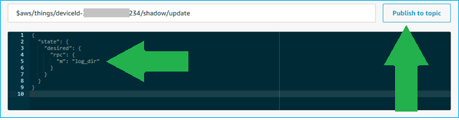

# Introduction

The document provides an overview for the Remote Procedure Call (RPC) mechanism implemented in the MG100-CT Gateway firmware along with a list of available RPC commands. The MG100-CT firmware is designed for use with BT510-CT and BT710 tracker devices.

# Overview

The Sentrius™ MG100-CT Gateway firmware implements an RPC mechanism providing system integrators with a means to send remote commands to trigger a set of maintenance operations. The device shadow is used as the mechanism to send RPC requests to the MG100-CT gateway and trigger operations that may perform maintenance tasks or post diagnostic data to designated MQTT topics.

# Sending an RPC Command

Once provisioned, the MG100 is setup to automatically connect and maintain a connection to its configured AWS IoT MQTT broker. The gateway both publishes to and subscribes for updates to/from its device shadow.
MG100 RPC commands are sent by updating the "desired" state of the device shadow with a property named "rpc". This "rpc" property defines an object specifying a **method** string and **parameter** object. These are eventually received by the MG100 and parsed as a device shadow delta, allowing the MG100 to pull the RPC command, clear it from the device shadow and perform the desired operation.

The general format of RPC commands as published to the device’s **shadow update topic** are as follows:

```
{
	"state": {
		"desired": {
			"rpc": {
				"m": "<method name>",
				"p": {
					"<param name>": "<param value>"
				}
			}
		}
	}
}
```

| Field           | Description                                                                                            |
| --------------- | ------------------------------------------------------------------------------------------------------ |
| \<method name\> | The remote procedure to invoke on the MG100                                                            |
| \<param name\>  | The name of a parameter used by the procedure being invoked                                            |
| \<param value\> | The value of the parameter to use when invoking the procedure (can be 0 or more of these in a request) |

For example, to trigger a reboot of an MG100, publish the following JSON data to the \$aws/things/\<thing name\>/shadow/update topic: (note there are no parameters required by this method)

```
{
	"state": {
		"desired": {
			"rpc": {
				"m": "reboot"
			}
		}
	}
}
```

# RPC Method List

The log commands are currently not supported.

## Reboot

### Method Parameters

None

### Example Command

```
{
	"state": {
		"desired": {
			"rpc": {
				"m": "reboot"
			}
		}
	}
}
```

### Outcome

The MG100 will reboot

## Log Directory Listing

The **log_dir** procedure is used to request the MG100 to publish a directory listing of available .log files on the internal microSDHC card if present.

### Method Parameters

None

### Example Command

```
{
	"state": {
		"desired": {
			"rpc": {
				"m": "log_dir"
			}
		}
	}
}
```

### Outcome

The MG100 will publish a UTF8 string containing a list of the most recent log files and sizes to \<topic-prefix\>/gw/\<IMEI\>/log.
The format of the directory listing will be as follows:

```
99990000.log 15318
20092023.log 92297
20092022.log 89268
20092021.log 80808
20092020.log 33552871
20092019.log 142541
```

Filenames have the format **YYMMDDHH.log** (YY: 2-digit year, MM: 2-digit month, DD: 2-digit date, HH: hour of the day)
Note that entries starting with **999900xx.log** capture log data when the clock is not set (i.e. no LTE signal).

## Log Get

The **log_get** procedure is used to request a portion of a log file stored on the internal microSDHC card if present.

### Method Parameters

| Property Name | Data Type | Description                                                 |
| :-----------: | :-------: | ----------------------------------------------------------- |
|       f       |  string   | Filename of .log file to publish                            |
|       w       |  string   | Specify "start" or "end" of file to read from               |
|       o       |  integer  | Offset from start/end of file to begin reading              |
|       l       |  integer  | Length (in bytes) of data to read from the file and publish |

To read from a log file, specify the filename with the "f" property. The "w" property indicates whether to grab a section starting at the beginning or end of the log file. The "o" property indicates how many bytes from the start or end of the file to begin reading from the log file. The "l" property indicates how many bytes to read from the log file (or if greater than the number of bytes available, all remaining bytes will be read).

### Example

This command requests that the MG100 publish 8192 bytes of a log file named "20092023.log" starting at 8192 bytes from the end of the file.

```
{
	"state": {
		"desired": {
			"rpc": {
				"m": "log_get",
				"p": {
					"f": "20092023.log",
					"w": "end",
					"o": 8192,
					"l": 8192
				}
			}
		}
	}
}
```

### Outcome

The MG100 will publish a sequence of UTF8 strings containing the requested section of the log file contents to \<topic-prefix\>/gw/\<IMEI\>/log. The format of the file will be something similar to the following:

```
20092023.log 8192 bytes @ 8192 from end
128 [38;5;68md9:d9:a5:85:74:78 (random), 1600645644
[38;5;163m[10 rec]  96 [38;5;68mca:23:28:1d:27:46 (random), 1600645770
[38;5;163m[10 rec]  96 [38;5;68mcb:ba:58:65:53:88 (random), 1600645770
[38;5;51m3 entries, 34 rec
[00:48:22.014,500] <inf> mg100_ble: Disconnected ee:32:d5:02:a1:4c (random) (reason 22)
[00:48:22.015,000] <dbg> mg100_ble.set_ble_state: LOG_DOWNLOAD->FINDING_DEVICE
[00:00:15.891,100] <dbg> mg100_lte.iface_ready_evt_handler: LTE is ready!
[00:00:15.957,600] <inf> modem_hl7800: RTC string: '"20/09/20,18:54:31-20"'
[00:00:15.957,800] <inf> mg100_lte: Epoch set to 1600646071
[00:00:16.971,800] <wrn> sdcard_log: saving logs to /SD:/20092023.log
[00:00:46.357,500] <inf> modem_hl7800: RSSI (RSRP): -105 SINR: 3
```

The publish will always begin with the first line indicating the name of the log file followed by the number of bytes to follow and indicating the offset and "start/end" value that was indicated in the request that triggered the publish. Due to size limitations on MQTT publish events from the MG100, each publish will contain at most 2048 bytes. To re-construct a full log file (e.g. all 8192 bytes in this case), the system must capture the sequence of publishes and concatenate them together. The last publish for a given log upload operation will end with the text string <eof> on its own line, indicating end of this file upload operation.

# Testing RPC with AWS IoT Core Console

The AWS IoT management console can be used to test out RPC commands and monitor responses from the MG100.

1. Start by logging into the AWS management console for the AWS account your MG100 is reporting in to.
2. Select the **IoT Core** service to navigate to the AWS IoT Core console
3. Click the **Test** sidebar menu item to bring up the MQTT client interface
4. Click **Subscribe to a topic** and type the topic prefix, followed by "/+/log" in the **Subscription topic** field and click the Subscribe to topic button. For example, if the MG100’s configured topic prefix is the default mg100-ct/dev/gw/, the full subscription topic would be mg100-ct/dev/gw/+/log.
   
   
5. Click **Publish to a topic** and near the bottom of the window, enter the publish topic of \$aws/things/\<thing name\>/shadow/update into the field next to the **Publish to topic** button. For example, the MG100 thing name is typically of the format **deviceId-\<IMEI\>** where \<IMEI\> is the IMEI number of the modem in the MG100. If the IMEI number was 123412341234234, the full publish topic would be: **\$aws/things/deviceId-123412341234234/shadow/update**.
   
   
6. Enter the desired shadow update JSON text in the field below the publish topic field. This will have the format as defined [here](#rpc-method-list) for the command you would like to send.
7. Press the **Publish to topic button** to send the shadow update. If the RPC method results in data being published to the **log** topic, you’ll see it show up in the log subscription portion of the management console window shortly after publishing if the MG100 is connected and monitoring for shadow updates.
   
