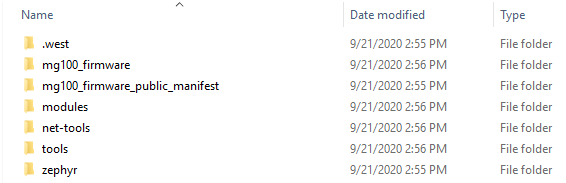
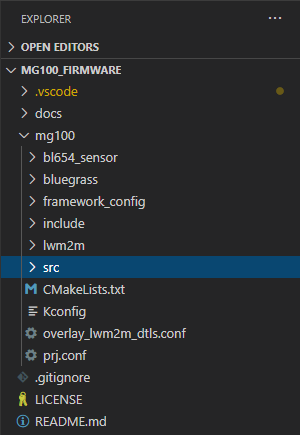
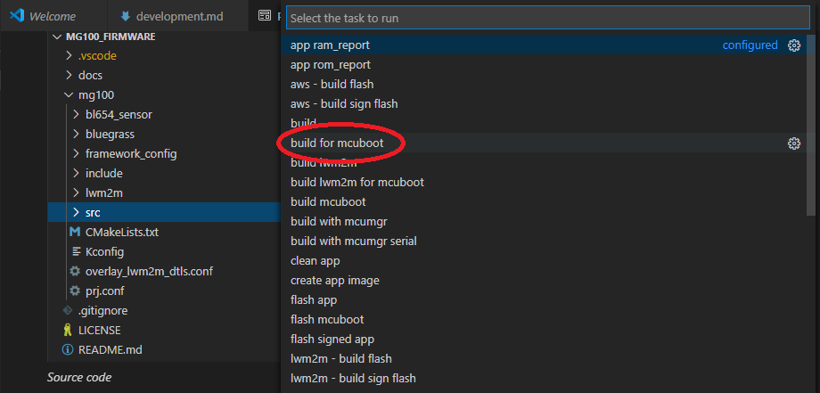
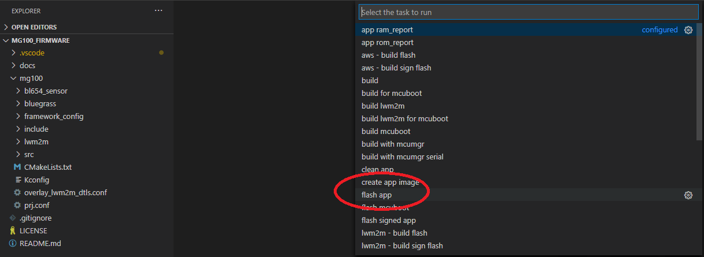
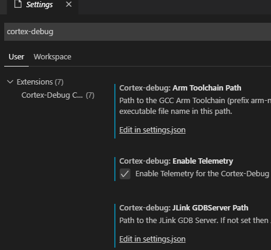

# Developing and Debugging the Firmware

The out of box demo source code can be used as a starting point for your own IoT cloud applications!
This document will explain how to use Visual Studio Code to build and debug the application.

> **Note:** These instructions assume you already have the Zephyr tools installed and can build the app successfully. Please see [here](https://github.com/LairdCP/Pinnacle-100-Firmware-Manifest#preparing-to-build) if you have not completed those steps.

## Prerequisites

1. Install [J-Link Software and Documentation Pack](https://www.segger.com/downloads/jlink/#J-LinkSoftwareAndDocumentationPack) for J-Link drivers and software.
2. Install [Visual Studio Code](https://code.visualstudio.com/)

   Install the following VS Code extensions

   1. [C/C++ extension](https://marketplace.visualstudio.com/items?itemName=ms-vscode.cpptools)
   2. [Cortex-Debug extension](https://marketplace.visualstudio.com/items?itemName=marus25.cortex-debug)

## Building the Firmware

After cloning this repository with `west` the directory structure should look like:

  
_Demo folder_

Open the _pinnacle_100_firmware_ folder with VS Code. The source code is then viewable in the _app_ folder.

  
_Source code_

There are VS Code tasks already setup to make building and flashing the firmware easy!

> **Note:** To view or edit the tasks. Look at [.vscode/tasks.json](../.vscode/tasks.json).

To build the firmware, run the build task by selecting **Terminal -> Run Build Task...**

> **Note:** This builds the firmware without the mcuboot bootloader. This is the best method for debugging.

  
_Run build task_

Once the firmware has built, you can flash the firmware by running the **flash application** task.

Select **Terminal -> Run Task...**, then select **flash application**.

  
_Run flash task_

## Debugging the Firmware

Debugging the firmware on the device requires a J-Link debugger and the Cortex-Debug extension for VS Code.

### Cortex-Debug Setup

Before debugging, some simple setup is required for Cortex-Debug. Go to **File -> Preferences -> Settings**.

At the top of settings type `cortex-debug` to display the settings for that extension. The _Arm Toolchain Path_ and _JLink GDB Server Path_ settings need to be set. Click one of the _Edit in settings.json_ links to edit the settings.

  
_Cortex-Debug settings_

Add the following lines to the settings.json file:

```
# Linux/macOS

"cortex-debug.armToolchainPath": "/usr/local/Caskroom/gcc-arm-embedded/9-2019-q4-major/gcc-arm-none-eabi-9-2019-q4-major/bin",

# Windows

"cortex-debug.JLinkGDBServerPath": "C:\\Program Files (x86)\\SEGGER\\JLink\\JLinkGDBServerCL.exe",
"cortex-debug.armToolchainPath": "C:\\GNU_Tools_Arm_Embedded\\8_2019-q3-update\\bin",
```

> **Notes:** The paths may be different based on your installations of those tools.

### Firmware Setup

In order to debug the firmware properly, it is recommended to change the optimization settings of the firmware when it is compiled. This allows better breakpoint support and viewing temporary variable values. In [prj.conf](../app/prj.conf) look for:

```
CONFIG_NO_OPTIMIZATIONS
CONFIG_DEBUG_OPTIMIZATIONS
```

You can uncomment **one** of the lines and re-build the firmware.

`CONFIG_NO_OPTIMIZATIONS` is equivalent to `-O0` in gcc. See [here](https://gcc.gnu.org/onlinedocs/gcc/Optimize-Options.html)

`CONFIG_DEBUG_OPTIMIZATIONS` is equivalent to `-Og`.

### Starting the Debugger

Once the firmware is built, debugging can be started by going to **Debug -> Start Debugging**

> **Note:** Debugger settings for VS Code are setup in [.vscode/launch.json](../.vscode/launch.json). That file is already setup to work with Cortex-Debug and this demo.

More info on debugging in VS Code can be found [here](https://code.visualstudio.com/docs/editor/debugging)
