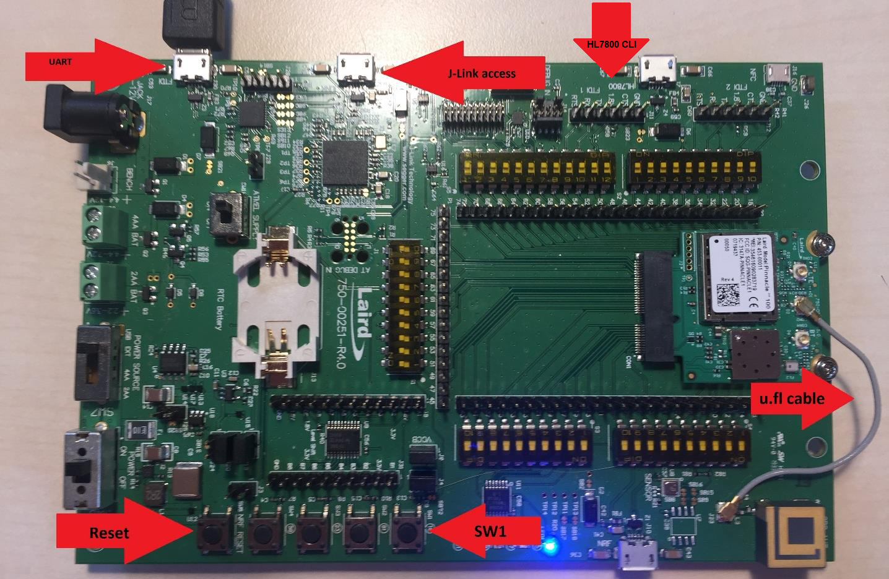
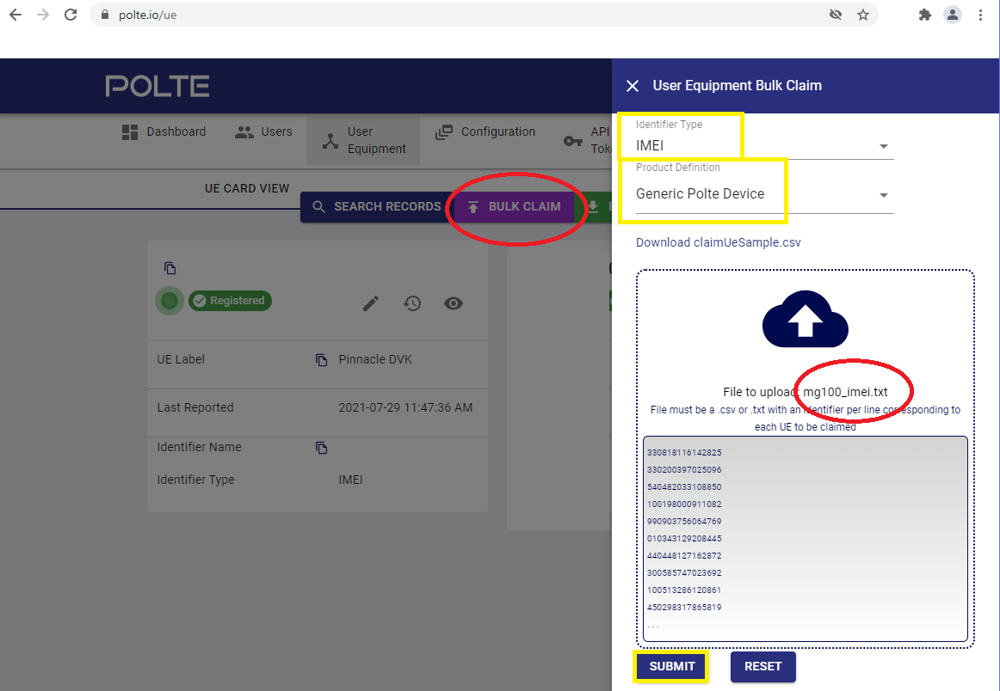

# Location Services (Pinnacle 100 and MG100 only)

## GPS

### Setup

With the development board powered off, connect a U.FL to U.FL cable between the GPS antenna of the Pinnacle 100 module (middle connector) to the connector near the GPS antenna on the development board.



Example U.FL cables can be found [here](https://www.sparkfun.com/products/15114), [here](https://uk.farnell.com/hirose-hrs/u-fl-2lphf6-04n1tv-a-300/rf-cord-u-fl-plug-u-fl-plug-wht/dp/3517346), and [here](https://www.rsonline-privat.de/Products/ProductDetail/Molex-50-Koaxialkabel-konfektioniert-Stecker-U-FL-7031345).

### Command Line Example

The location of the Pinnacle DVK can be obtained by issuing commands at the shell. These commands can also be used as a reference for a custom application. When in GPS mode, the modem is put into airplane mode.

When the GPS rate is non-zero, the application will query the location periodically. For example, every 30 seconds.

```
attr set gpsRate 30
```

The DVK will indicate when it has received valid GPS information.

```
gpsStatus                     3 3D Available
```

If a fix is maintained, the location will be reported at the GPS rate.

```
gpsLatitude                   '43 Deg 17 Min 6.60 Sec N'
gpsLongitude                  '87 Deg 59 Min 29.89 Sec W'
gpsTime                       '2021 7 29 16:44:21'
gpsFixType                    '3D'
gpsHepe                       '0.29 m'
gpsAltitude                   '233.500 m'
gpsAltUnc                     '0.0 m'
```

Exit GPS mode

```
attr set gpsRate 0
```

GPS works best outside. The following log indicates that the signal is weak.

```
[00:02:56.176,544] <inf> attr: [253] gpsStatus                     0 Fix Lost Or Not Available
[00:03:11.175,659] <inf> attr: [253] gpsStatus                     3 3D Available
[00:03:15.175,689] <inf> attr: [253] gpsStatus                     0 Fix Lost Or Not Available
[00:03:16.175,720] <inf> attr: [253] gpsStatus                     3 3D Available
[00:03:38.175,872] <inf> attr: [253] gpsStatus                     0 Fix Lost Or Not Available
[00:03:40.175,903] <inf> attr: [253] gpsStatus                     3 3D Available
[00:03:43.177,917] <inf> attr: [253] gpsStatus                     0 Fix Lost Or Not Available
[00:03:46.175,933] <inf> attr: [253] gpsStatus                     3 3D Available
[00:03:47.177,947] <inf> attr: [253] gpsStatus                     0 Fix Lost Or Not Available
[00:03:49.180,328] <inf> attr: [253] gpsStatus                     3 3D Available
```

## PoLTE

Position over LTE requires an account with [polte.io](https://polte.io/). 

When using this feature the modem sends RF signal information to a server that computes location.  The modem then provides the result to the application.

### Cloud Server Setup

Issue the following command to the gateway.

```
hl imei
```

Save the result to a text file.

```
123456789123456
```

On polte.io, select bulk claim and add device.  Use an identifier type of IMEI, production definition of Generic Polte Device, and provide the text file saved in the previous step.



### Gateway Setup

To use PoLTE, it must be enabled by sending the following commands. This must be done anytime the HL7800 firmware is updated.

Step 2 requires a 1.8V FTDI cable.  On the Pinnacle DVK, the 6-pin header is labelled with HL7800 and FTDI 1 on the silkscreen.  To perform this operation on the MG100, it must be opened, and a 6-pin header must be held in place at J6. The square pin is ground.

These steps may not be required in a future version of HL7800 firmware.

1. Using the Application shell, issue the following commands (see image above).  The USB port is labelled FTDI on the silkscreen of the Pinnacle DVK. This terminal's settings are 115200 8-N-1 with RTS/CTS flow control.

```
hl cmd 10 AT+SWITRACEMODE=RnD
hl cmd 10 AT+CFUN=1,1
```

2. Using the **HL7800** shell, issue the following commands. This terminal's settings are also 115200 8-N-1, but the flow control type is none.

```
config -s locsrv.operation.locsrv_enable true
config -s polte.config.enable true
```

3. Switch back to customer mode and reset the device using the application shell.

```
hl cmd 10 AT+SWITRACEMODE=CUSTOMER
hl cmd 10 AT+CFUN=1,1
```

### Command Line Example

Wait until the network is connected before issuing any of the following commands.

```
gatewayState                  3 Network Connected
```

The first time a SIM is used it must be registered with the PoLTE service.

```
attr set polteControlPoint 1
```

This command results in the username and password being stored into application non-volatile memory.

```
polteControlPoint             1 Register
polteStatus                   127 Busy
control.polte_cmd_handler: PoLTE command status 0
polteStatus                   0 Success
polteUser                     'XEezMxsYtbM'
attr.save_attributes: Wrote 609 of 609 bytes of parameters to file
poltePassword                 'popdlaOQrAq'
```

Note: After registration, a device's login information can also be found on polte.io.


After reset and before issuing a locate command, the PoLTE server login information must be provided to the HL7800 (user/password from register command) and PoLTE events must be enabled.

```
attr set polteControlPoint 2
```

```
polteControlPoint             2 Enable
polteStatus                   127 Busy
polteStatus                   0 Success
control.polte_cmd_handler: PoLTE command status 0
```

Now the system is ready and the locate command can be issued.

```
attr set polteControlPoint 3
```

The locate command can require 120 seconds to complete.  The first response is the status of sending the location command.

```
polteControlPoint             3 Locate
polteStatus                   127 Busy
polteStatus                   100 Locate In Progress
```

If a result is not returned after 2 minutes, then send the locate command again.

```
attr set polteControlPoint 3
```

The second response contains the location information.  The server error can be ignored in this case.

```
polteControlPoint             3 Locate
polteStatus                   127 Busy
polteStatus                   100 Locate In Progress
...
polteStatus                   0 Success
polteLatitude                 '43.283922979565396'
polteLongitude                '-87.98514971228644'
polteTimestamp                1627577256
polteConfidence               '379.51'
polteStatus                   10 Server Error
```

## Data Formats

Details on each attribute can be found in [this document](../app/attributes/attributes.json).  The GPS and PoLTE values are near the end.

The PoLTE values are not stored as floats because precision could be lost.

Each of these systems uses a different format for the coordinates.  The GPS system uses degrees, minutes, and seconds (DMS).  PoLTE uses decimal degrees.

More information and how to convert between them can be found [here](https://en.wikipedia.org/wiki/Decimal_degrees).
