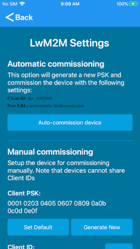
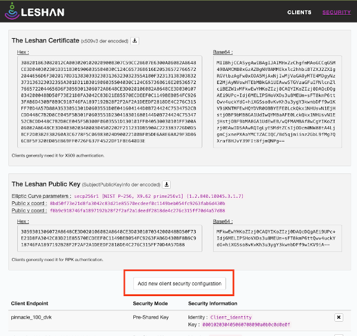
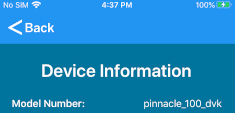
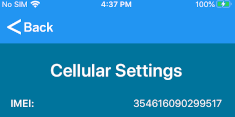
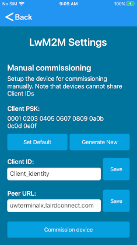
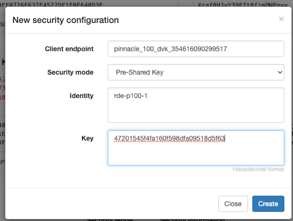
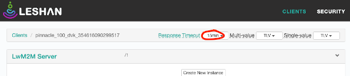
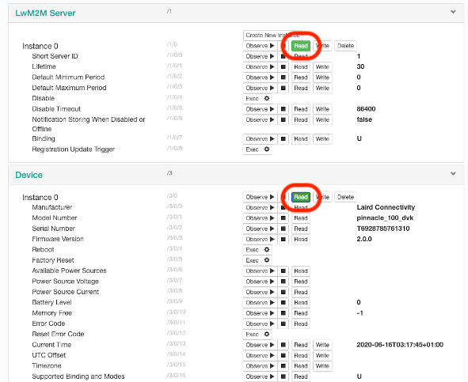
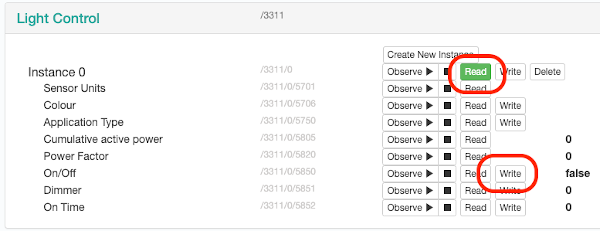

# LwM2M Demo

## Table of Contents

1. **[Introduction](#introduction)**
2. **[Resources](#resources)**
3. **[Prerequisites](#prerequisites)**
4. **[Setup](#setup)**
5. **[Using the Demo](#using-the-demo)**  
   [Auto Commissioning](#auto-commissioning)  
   [Manual Commissioning](#manual-commissioning)  
   [View Cloud Data](#view-cloud-data)
6. **[User Defined Server](#user-defined-server)**
7. **[LED Behavior](#led-behavior)**
8. **[Building the Firmware](#building-the-firmware)**
9. **[Development](#development)**

## Introduction

When using NB-IoT on the Pinnacle 100/MG100, we do not recommend using the TCP protocol due to the network latencies inherent to NB-IoT. UDP is recommended for NB-IoT data transfer (Applies to Pinnacle 100/MG100 only).
In this configuration, the Pinnacle 100/BL5340 device is configured to use LwM2M and DTLS with pre-shared keys. [LightweightM2M (LwM2M)](http://www.openmobilealliance.org/wp/Overviews/lightweightm2m_overview.html) is a protocol that runs on top of [CoAP](https://coap.technology/).

A [Leshan Server](https://www.eclipse.org/leshan/) is used to display information about the Pinnacle 100/BL5340 device and a connected BL654 Sensor Board/ESS BLE sensor.

The software version, model, manufacturer, serial number, and current time can be read. If a BL654 Sensor Board/ESS sample module is detected and can be connected to, then temperature, humidity, and pressure can be read. In addition, the green LED on the Pinnacle 100 device and LED 4 on the BL5340 development kit can be turned on and off using the light control object.

```
                XXXXX
              XXX   XXX
    XXXXX   XX        XX
 XXX    XX XX          X XXXXXXX
 X        XX            X       XX
X                                X
 X       Leshan LwM2M Server      X
 XX                              X
  XXXXXXX                       XX
        XX          XXXX    XXXX
         XXX      XXX   XXXX
           XXXXXXX
               ^
               +
NB-IoT or Ethernet (LwM2M with DTLS)
               +
               v
     +---------+----------+
     |                    |
     |     DVK/MG100      |
     |                    |
     +---------+----------+
               ^
               +
              BLE
               +
               v
    +----------+------------+
    |                       |
    |  BL654/ESS Sensor     |
    |                       |
    +-----------------------+

```

## Resources

- [MG100 product page](https://www.lairdconnect.com/iot-devices/iot-gateways/sentrius-mg100-gateway-lte-mnb-iot-and-bluetooth-5)
- [Pinnacle 100 Modem product page](https://www.lairdconnect.com/wireless-modules/cellular-solutions/pinnacle-100-cellular-modem)
- [BL5340 product page](https://www.lairdconnect.com/wireless-modules/bluetooth-modules/bluetooth-5-modules/bl5340-series-multi-core-bluetooth-52-802154-nfc-modules)

## Prerequisites

The following are required to fully exercise this demo firmware:

- An activated SIM card. The Truphone SIM card that comes with the DVK does not currently support NB-IoT. If you have purchased a DVK in Europe, then please contact [sales](mailto:sales@lairdconnect.com) to obtain a SIM card that is NB-IoT capable (Pinnacle 100/MG100 only).
- Pinnacle 100/BL5340 device programmed with NB-IoT/LwM2M demo firmware.
  - Connect to the FTDI UART on the development kit to view firmware logs
- Laird Pinnacle Connect app installed on a mobile device
  - [Android app](http://play.google.com/store/apps/details?id=com.lairdconnect.pinnacle.connect)
  - [iOS app](https://apps.apple.com/us/app/laird-pinnacle-connect/id1481075861?ls=1)

## Setup

To set up the device, follow these steps:

1. Ensure an _activated_ SIM card is inserted into the Pinnacle 100 SIM slot (Pinnacle 100/MG100 only).
2. On your phone, launch the Pinnacle mobile app and follow the on-screen prompts.

## Using the Demo

If the Laird Connectivity Leshan server is used, then the device should be configured to something other than its default settings. This allows multiple devices to connect to the same server.

### Auto Commissioning

1. Open the mobile app, connect to your device and go to the LwM2M Settings page.
2. Click the Auto-commission device button. This will automatically add the Pinnacle 100 device with a unique ID to the Leshan LwM2M server.

  
_Auto-commission device_

3. Skip to [View Cloud Data](#view-cloud-data) for instructions on interacting with your device.

### Manual Commissioning (Pinnacle 100/MG100 only)

1. Open [Laird Connectivity Leshan web page](http://uwterminalx.lairdconnect.com:8080/#/clients).
2. Go to the Security page.
3. Press "Add new client configuration".

  
_Leshan add device_

4. Using the Pinnacle Connect mobile app, read the model number from the Device Information page.

  
_Model number_

5. With the mobile app, read the IMEI from the Cellular Settings page.

  
_IMEI_

6. Enter <model number>\_<imei> into the Client endpoint field on the webpage. For example, mg100_354616090287629.
7. Generate a new private shared key using the LwM2M Settings page in the mobile app.
8. Copy the value into the Key field on the webpage.
9. Set and save the Client ID using the mobile app (don't reuse a name that is already present on the server).
10. Put the same name into the Identity field on the web page.

  
_LwM2M settings_

  
_Leshan device config_

10. Reset the modem using the mobile app (Power Settings page) or reset button (SW5 NRF_RESET).

### View Cloud Data

From the [clients page](http://uwterminalx.lairdconnect.com:8080/#/clients), click on your device once it is connected to interact with it.

- Make sure to set the Response Timeout to something greater than 5s at the top of the page.

  
_Leshan response timeout_

- Click `Read` at the top of an object to read all child values. In some cases, not all child values are supported.

  
_Leshan read object_

- The Light Control object can be used to control an LED on the device as [described here below](#led-behavior). Write `true` or `false` to the On/Off node.

  
_Leshan light control_

## User Defined Server

In addition to the steps in the [Using the Demo](#using-the-demo) section, the Peer URL must be set using the mobile app.

## LED Behavior

### Pinnacle 100/MG100

The Blue LED blinks once a second when the Pinnacle device is advertising. While it is connected, the LED remains on.

The Green LED can be controlled via the LwM2M server Light Control object (Pinnacle 100 only).

The Red LED blinks when the Pinnacle 100 device is searching for a cellular network. It remains on and does not blink when connected to a network. If there is an error with the SIM card or network registration, then the LED remains off.

### BL5340

LED 1 blinks when the module is advertising and allowing another device to connect to and configure it. When a central device connects, the LED remains on. When advertising stops, the LED remains off. Button 1 can be pressed to restart advertising.

LED 2 blinks once a second when the module is searching for a BL654 Sensor Board/ESS service device. When it finds a sensor and successfully connects to it, the LED remains on.

LED 3 is on when network connectivity is established, it remains off when there is no network connection.

LED 4 can be controlled via the LwM2M server Light Control object.

## Building the Firmware

### Pinnacle 100/MG100

The firmware can be built to work with or without the mcuboot bootloader. Building without mcuboot is faster and easier for development and debug, but gives up the ability to update the Zephyr app via UART or BLE.

> **Note:** If using [VS Code for development](development.md) the `build lwm2m with mcuboot` and `build lwm2m` tasks can be used to easily build the firmware.

Issue these commands **from the pinnacle_100_firmware directory**.

> **WARNING:** If using windows, checkout code to a path of 12 characters or less to avoid build issues related to path length limits.

Build without mcuboot:

> **Note:** `[board]` should be replaced with `mg100` or `pinnacle_100_dvk`

```
# Linux and macOS

rm -f app/pm_static.yml && west build -b [board] -d build/[board]/lwm2m app

# Windows

del app\pm_static.yml && west build -b [board] -d build\[board]\lwm2m app
```

> **Note:** When switching between builds with or without mcuboot, be sure to delete the build directory before building.

Build with mcuboot:

> **Note:** `[board]` should be replaced with `mg100` or `pinnacle_100_dvk`

```
# Linux and macOS

cp ../modules/zephyr_lib/mcuboot_config/pm_static.pinnacle100.yml app/pm_static.yml

west build -b [board] -d ${PWD}/build/[board]/lwm2m ${PWD}/app -- -DOVERLAY_CONFIG="${PWD}/app/overlay_lwm2m_dtls.conf ${PWD}/../modules/zephyr_lib/mcumgr_wrapper/config/overlay-mcuboot.conf" -Dmcuboot_DTC_OVERLAY_FILE=${PWD}/app/boards\pinnacle_100.overlay -Dmcuboot_CONF_FILE=${PWD}\..\modules\zephyr_lib\mcuboot_config\pinnacle_100.conf

# Windows

copy ..\modules\zephyr_lib\mcuboot_config\pm_static.pinnacle100.yml app\pm_static.yml

west build -b [board] -d %CD%\build\[board]\lwm2m %CD%\app -- -DOVERLAY_CONFIG="%CD%\app\overlay_lwm2m_dtls.conf %CD%\..\modules\zephyr_lib\mcumgr_wrapper\config\overlay-mcuboot.conf" -Dmcuboot_DTC_OVERLAY_FILE=%CD%\app\boards\pinnacle_100.overlay -Dmcuboot_CONF_FILE=%CD%\..\modules\zephyr_lib\mcuboot_config\pinnacle_100.conf
```

After building the firmware, it can be flashed with the following command:

> **Note:** `[board]` should be replaced with `mg100` or `pinnacle_100_dvk`

```
# Linux and macOS

west flash -d build/[board]/lwm2m

# Windows

west flash -d build\[board]\lwm2m
```

If the firmware was built with mcuboot, `west flash` will program merged.hex which contains the mcuboot bootloader and app in a combined image.

### BL5340

The firmware can only be built with mcuboot.

Issue these commands **from the ble_gateway_firmware directory**.

> **WARNING:** If using windows, checkout code to a path of 12 characters or less to avoid build issues related to path length limits.

```
# Linux and macOS

cp app/boards/pm_static_bl5340_dvk.yml app/pm_static.yml

west build -b bl5340_dvk_cpuapp -d ${PWD}/build/bl5340_dvk_cpuapp/lwm2m ${PWD}/app -- -DOVERLAY_CONFIG="${PWD}/app/overlay_lwm2m_dtls.conf ${PWD}/../modules/zephyr_lib/mcumgr_wrapper/config/overlay-mcuboot.conf" -Dmcuboot_CONF_FILE=${PWD}/../modules/zephyr_lib/mcuboot_config/bl5340.conf

# Windows

copy app\boards\pm_static_bl5340_dvk.yml app\pm_static.yml

west build -b bl5340_dvk_cpuapp -d %CD%\build\bl5340_dvk_cpuapp\lwm2m %CD%\app -- -DOVERLAY_CONFIG="%CD%\app\overlay_lwm2m_dtls.conf %CD%\..\modules\zephyr_lib\mcumgr_wrapper\config\overlay-mcuboot.conf" -Dmcuboot_CONF_FILE=%CD%\..\modules\zephyr_lib\mcuboot_config\bl5340.conf
```

After building the firmware, it can be flashed with the following command:

```
# Linux and macOS

west flash -d build/bl5340_dvk_cpuapp/lwm2m

# Windows

west flash -d build\bl5340_dvk_cpuapp\lwm2m
```

## Development

See [here](development.md) for help on getting started with custom development.

## Cellular Network Information

See [here](site_survey.md) for instructions on how to get details about the cell network (Pinnacle 100/MG100 only).
